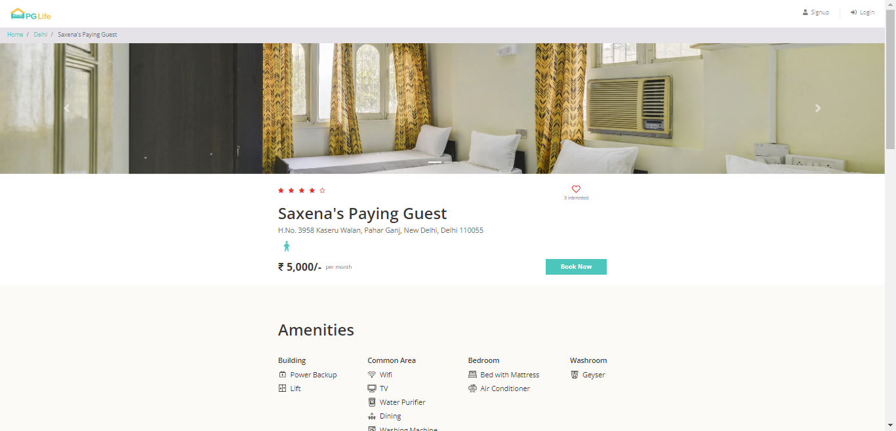

[README.md](https://github.com/user-attachments/files/22561895/README.md)
# 🏠 PgLife – Full Stack Website


---

## 📖 Project Overview
**PgLife** is a full-stack web application designed to help students and working professionals find Paying Guest (PG) accommodations with ease.  
It provides a user-friendly interface for browsing PG listings, filtering options, and viewing details about amenities, pricing, and location.

---

## ✨ Features
- 🔍 Search PGs by city and locality  
- 🏘️ View detailed PG information (amenities, pricing, rules, etc.)  
- 📱 Responsive design using Bootstrap and CSS3  
- ⚡ Dynamic user interface built with **React**  
- 💾 Backend powered by **PHP** and **MySQL**  
- 🎨 Interactive and modern design  

---

## 🛠️ Technologies Used
- **Frontend**: HTML5, CSS3, Bootstrap, JavaScript, React  
- **Backend**: PHP  
- **Database**: MySQL  

---

## 🚀 Getting Started

### 1️⃣ Clone the Repository
```bash
git clone https://github.com/aqib897/PgLife.git
```

### 2️⃣ Navigate to the Project Folder
```bash
cd PgLife
```

### 3️⃣ Setup Database
- Import the SQL file in the `database/` folder into MySQL.
- Update database credentials in `include/databaseconnect.php`.

### 4️⃣ Run the Project
- Open with XAMPP/WAMP or any local server environment.
- Access in browser at: `http://localhost/PgLife`

---

## 📷 Screenshots

### 🏠 Home Page


### 🔍 PG Listings Page


### 🏘️ PG Details Page


### 👤 User Login / Signup Page


---

## 🤝 Contributing
Contributions are welcome!  
Feel free to fork this repo, create a branch, and submit a pull request.

---

## 📧 Contact
For queries or collaboration, reach out at: **shekhaqib93@gmail.com**
